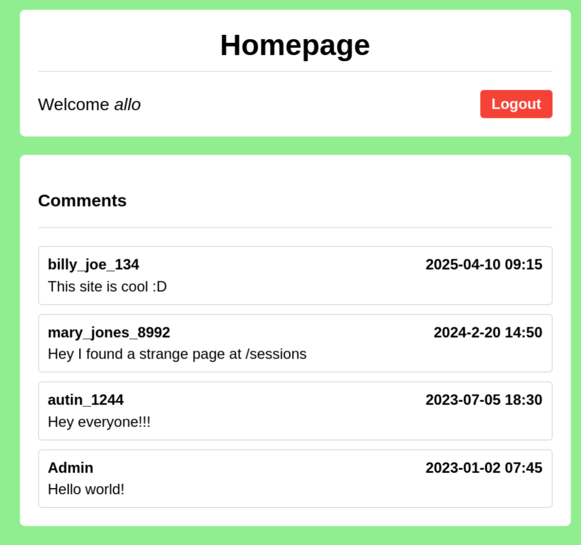
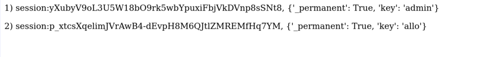
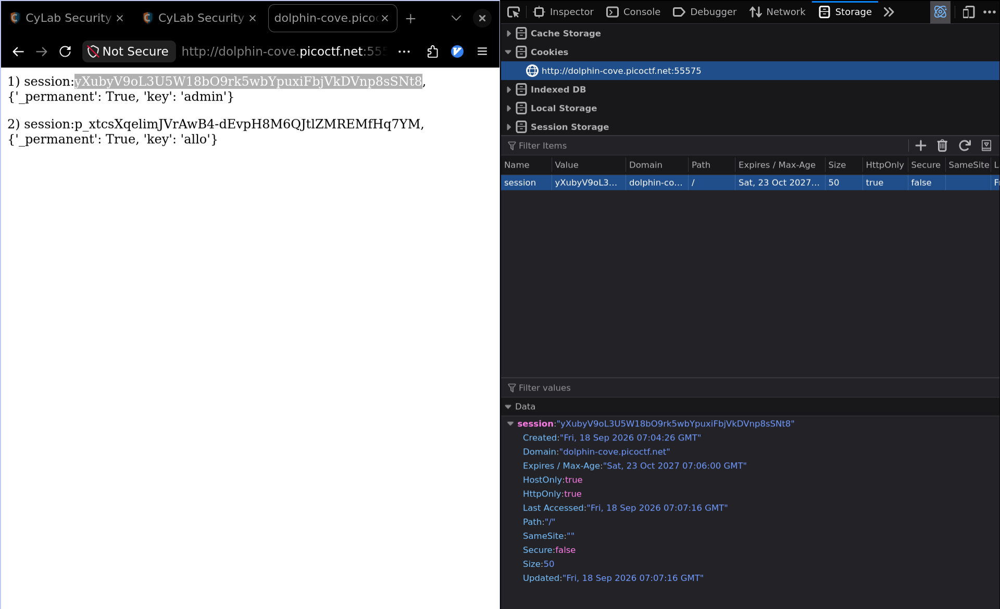

# Old Sessions - Web Exploitation (easy)

The challenge description hints at some sort of session token that doesn't expire.
Getting into the page, I register and create a new user for myself.
Then login with this new user.

Right of the bat, I notice two things:
1. `Admin` user, probably what I want to get into
2. A comment by `mary_jones_8992`
    >  Hey I found a strange page at /sessions 

Navigating to /sessions:

Notice the session token of `admin` is just right there? Simply entering this
sesssion token

Navigate back to the home-page, and we have our flag!
